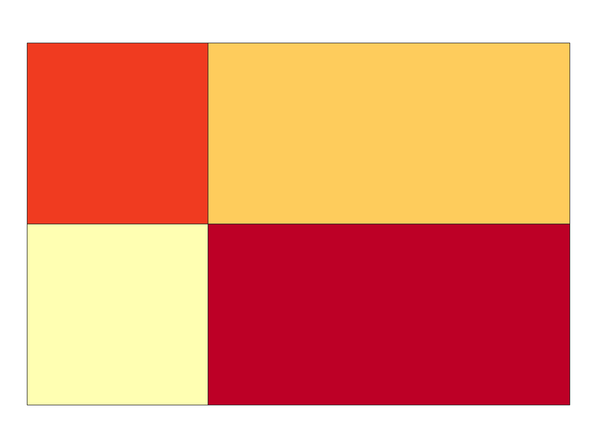

# qgis-mcp-workflows

A focused fork of [`nkarasiak/qgis-mcp`](https://github.com/nkarasiak/qgis-mcp) for
**transportation-research figure pipelines** — PFLOW, GUFM, weekly decks (the "W17"
pattern). 13 workflow tools (collapsible to 5 in compound mode), two transports,
CI-friendly.

> Renamed from `qgis-mcp-north` in v1.1.0. The fork's positioning (workflow tools, not 51 PyQGIS primitives) is now in the name. Existing users: see the [migration note](#v110-rename-migration) below.



## What this is (and isn't)

**This fork ships workflow tools, not PyQGIS API mirrors.** Each tool encapsulates
an end-to-end action: render a choropleth, drop figures into a deck, batch a
parameter sweep. The fork was cut from upstream's 51-tool surface specifically to
make end-to-end figure pipelines a single LLM prompt.

If you need feature editing, processing algorithms, layer-tree management, or
plugin tooling — install [upstream `nkarasiak/qgis-mcp`](https://github.com/nkarasiak/qgis-mcp)
**side by side**. The two run together: different plugin folders, different ports
(9877 vs 9876), different package names. Claude Desktop sees both MCP servers and
the LLM picks per request.

## Architecture

```
                   ┌───────────────────────────────────────┐
                   │          MCP Server (FastMCP)         │
                   │   src/qgis_mcp_workflows/server.py        │
                   └───────────────┬───────────────────────┘
                                   │
                      ┌────────────┴────────────┐
                  transport=plugin        transport=headless
                      │                         │
       TCP socket → port 9877    subprocess → PyQGIS Python
       → QGIS Desktop plugin     (no QGIS Desktop needed)
                      │                         │
                      └──────────┬──────────────┘
                                 ▼
                             PyQGIS API
```

Both transports execute the **same** plugin handler code (`QgisMCPServer.execute_command`).
The headless runner injects a stub `iface` that no-ops UI calls. Every command
handler that doesn't touch the canvas / layer-tree-view works in both transports
for free — a v0.4 architectural promise that v0.5+ tools inherit.

## Tools (13 standalone, 5 in compound mode)

| Tool | Purpose |
|---|---|
| `qgis_layer_inspect` | Metadata-only inspect (no project mutation) |
| `qgis_load_layer` | Register layer + return layer_id; optional CRS override |
| `qgis_project_load` | Load `.qgz`/`.qgs` → layers + layouts |
| `qgis_style_categorized` | Categorical (one color per value) symbology |
| `qgis_style_graduated` | Graduated (value-binned) — quantile/equal/jenks/pretty |
| `qgis_render_map` | Generic multi-layer render to PNG |
| `qgis_render_choropleth` | Zone polygon + value CSV → choropleth, one call |
| `qgis_render_trajectory` | Lines/points/heatmap from CSV/GPX. Stride sampling; optional `movingpandas` speed bins |
| `qgis_render_od_flows` | Origin-destination arcs over a zones layer, data-defined widths |
| `qgis_export_layout` | Print-composer → PNG/PDF/SVG |
| `qgis_batch_render` | Fan-out per attribute value; manifest + per-value errors |
| `qgis_figures_to_pptx` | Assemble PNGs into a PowerPoint deck |
| `qgis_eval` | Arbitrary PyQGIS escape hatch with `return_vars` capture |

Full input/output schemas, response shapes, and error taxonomy: [`docs/DESIGN.md`](docs/DESIGN.md).

### Compound mode

Set `QGIS_MCP_WORKFLOWS_TOOL_MODE=compound` to collapse the surface to 5 grouped tools
for token-constrained LLMs (Haiku, small open-weights). Same plumbing, smaller
schema:

- `qgis_inspect(kind, path, register?)` → replaces `layer_inspect` / `load_layer` / `project_load`
- `qgis_style(type, ...)` → replaces both styling tools
- `qgis_render(mode, ...)` → replaces the 4 render tools
- `qgis_export(kind, ...)` → replaces layout/batch/pptx
- `qgis_eval` → unchanged

## Quickstart

### 1. Prerequisites

- **QGIS** 3.28 or newer ([download](https://qgis.org/download/)). On Windows, the
  OSGeo4W LTR installer is recommended; on macOS, the QGIS-LTR `.app` from qgis.org.
- **Python** 3.12+
- **uv** package manager — [install uv](https://docs.astral.sh/uv/getting-started/installation/)

### 2. Clone + install

```bash
git clone https://github.com/wattwong103/qgis-mcp-workflows.git
cd qgis-mcp-workflows
python install.py
```

The installer:
- Symlinks `qgis_mcp_workflows_plugin/` into your active QGIS profile.
- Sets up the Python venv (`uv sync`).
- Optionally configures MCP clients (Claude Desktop, Cursor, VS Code, Windsurf, Zed, Claude Code).

Non-interactive:

```bash
python install.py --non-interactive --clients claude-desktop,cursor
```

Remote mode (no clone needed; uses `uvx` from GitHub):

```bash
python install.py --remote --clients claude-desktop
```

### 3. Enable the plugin in QGIS

1. Restart QGIS.
2. Plugins menu → Manage and Install Plugins → enable "QGIS MCP Workflows".
3. Click "Start Server" in the MCP dock widget (listens on `localhost:9877`).

### 4. Use it

From any MCP client:

```
> Render a choropleth of zone_trips.csv joined to polbnda_jpn_new.shp on zone_id,
  total_trips field, YlOrRd palette, quantile breaks. Save to C:\temp\choropleth.png.
```

Concrete PFLOW recipes: [`docs/pflow-usage.md`](docs/pflow-usage.md).

## Configuration

| Variable | Default | Description |
|---|---|---|
| `QGIS_MCP_WORKFLOWS_TRANSPORT` | `auto` | `plugin` / `headless` / `auto` (probe :9877, fall back to headless) |
| `QGIS_MCP_WORKFLOWS_TOOL_MODE` | `full` | `full` (13 tools) / `compound` (5 grouped tools) |
| `QGIS_MCP_WORKFLOWS_HOST` | `localhost` | Plugin socket host |
| `QGIS_MCP_WORKFLOWS_PORT` | `9877` | Plugin socket port (upstream uses 9876) |
| `QGIS_MCP_WORKFLOWS_QGIS_LAUNCHER` | (auto-detected) | Headless: Windows `python-qgis(-ltr).bat`, or macOS `<QGIS.app>/Contents/MacOS/bin/python3` |
| `QGIS_MCP_WORKFLOWS_LOG_FILE` | `~/.local/share/qgis-mcp-workflows/server.log` | Rotating log (5MB × 3); empty disables |
| `QGIS_MCP_WORKFLOWS_LOG_LEVEL` | `INFO` | File log level (console always WARNING+) |

CLI flag `--transport=plugin|headless|auto` overrides the env var.

## Headless mode (cron / unattended renders)

Windows:

```powershell
$env:QGIS_MCP_WORKFLOWS_TRANSPORT='headless'
$env:QGIS_MCP_WORKFLOWS_QGIS_LAUNCHER='M:\QGIS LTR\bin\python-qgis-ltr.bat'
uv run --no-sync qgis-mcp-workflows-server
```

macOS — the launcher is auto-detected from `/Applications/QGIS*.app`, so no path
is needed:

```bash
QGIS_MCP_WORKFLOWS_TRANSPORT=headless uv run --no-sync qgis-mcp-workflows-server
```

`HeadlessExecutor` lazy-spawns a PyQGIS subprocess on first dispatch and keeps it
open for the MCP session lifetime. `initQgis` costs ~1-2s per cold start; never
restart per call.

## Platform support

- **Windows** — supported since v1.0. Tested with OSGeo4W LTR.
- **macOS** — supported since v1.4.1. Headless transport verified end-to-end
  against QGIS-LTR 3.40.5 on Apple Silicon (choropleth render, correct graduated
  ramp, `EPSG:4326`/`EPSG:6677` resolving). Plugin transport uses the same profile
  paths `install.py` already handled. The headless launcher is auto-detected from
  `/Applications/QGIS-LTR.app` (then `QGIS.app`, then any `QGIS*.app`), and the
  subprocess inherits `PROJ_LIB`, `GDAL_DATA` and `QGIS_PREFIX_PATH` derived from
  that bundle. Homebrew's `python3` is deliberately *not* used — it has no PyQGIS.
- **Linux** — should work via PyQGIS-on-PATH (apt/conda installs put it on
  `sys.executable`); set `QGIS_MCP_WORKFLOWS_QGIS_LAUNCHER` if not. Unverified.

### macOS notes

Two things bite anyone running PyQGIS outside the `.app` bundle, and both are
handled automatically — they matter only if you set the env vars yourself:

- **`PROJ_LIB` / `GDAL_DATA`.** Without them PROJ can't open `proj.db` and *every*
  CRS comes back invalid — `QgsCoordinateReferenceSystem("EPSG:4326").isValid()`
  is `False`. Renders then reproject wrong instead of failing loudly.
- **The user profile.** QGIS derives it from Qt's organization/application name.
  Unset, it resolves to `~/Library/Application Support/profiles/default` rather
  than `.../QGIS/QGIS3/profiles/default`, `QgsStyle.defaultStyle()` loads zero
  color ramps, and every graduated render silently collapses to one flat colour
  for all classes.

QGIS-LTR bundles **Python 3.9**, so everything under `qgis_mcp_workflows_plugin/`
(which runs in QGIS's interpreter, not the server's 3.12) must stay 3.9-compatible.

## Development

```bash
# Unit tests (no QGIS needed — mocked executor)
uv run --no-sync pytest tests/

# Lint
uv tool run ruff check src/ tests/ scripts/

# Benchmarks (opt-in)
uv sync --extra bench --extra trajectory
uv run --no-sync --extra bench pytest tests/benchmarks/ -m bench

# End-to-end W17 demo (synthetic fixtures only — runnable in CI)
uv run --no-sync scripts/demo_w17.py
```

## Coexistence with upstream

Both `qgis-mcp-workflows` (this fork) and `nkarasiak/qgis-mcp` can run side-by-side:

| | This fork | Upstream |
|---|---|---|
| Plugin folder | `qgis_mcp_workflows_plugin/` | `qgis_mcp_plugin/` |
| Default port | 9877 | 9876 |
| Package name | `qgis_mcp_workflows` | `qgis_mcp` |
| Tool count | 13 (or 5 compound) | 51 |
| Headless | yes | no |

Claude Desktop sees both servers; the LLM picks per request. Use **upstream** when
you need the long tail of PyQGIS primitives (feature editing, processing
algorithms, layer-tree groups). Use **this fork** for the figure-rendering
workflows above.

## Project status

- **v1.0.0** (2026-05-14): Tool surface complete. 99 unit tests pass.
- See [`CHANGELOG.md`](CHANGELOG.md) for the full history.

## v1.1.0 rename migration

If you previously installed `qgis-mcp-north`:

1. Re-run the installer: `python install.py` — it will install the new plugin folder (`qgis_mcp_workflows_plugin/`) and add a new MCP client config key (`qgis-workflows`).
2. Remove the old plugin folder: `~/.local/share/QGIS/QGIS3/profiles/default/python/plugins/qgis_mcp_north_plugin` (Windows: `%APPDATA%\QGIS\QGIS3\…`).
3. Remove the old MCP client entry: `python install.py --uninstall --clients claude-desktop` against the `v1.0.0` version of this repo, or hand-edit `claude_desktop_config.json` to remove the `"qgis-north"` key.
4. Restart QGIS, enable the "QGIS MCP Workflows" plugin in the Plugins dialog, click Start Server.
5. Env vars: rename any `QGIS_MCP_NORTH_*` in your shell profile / launch scripts → `QGIS_MCP_WORKFLOWS_*`. Port `9877` is unchanged.

## License

GPL-3.0 — inherited from upstream `nkarasiak/qgis-mcp`. See [`LICENSE`](LICENSE).
